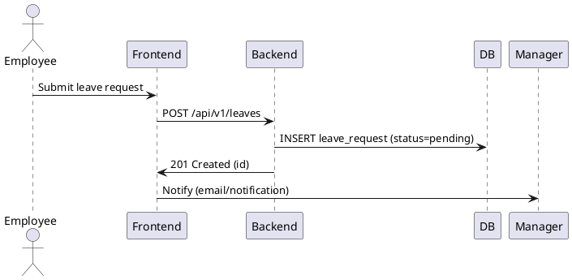

# System Design Document (SDD)

Last updated: 2025-11-03

This document summarizes the architecture, components, API summaries, data flows, deployment notes, and operational considerations for the HRMS project in this repository.

## High-level architecture

- Frontend: React + Vite + Tailwind CSS. Role-based UI with modals (attendance, leave, payroll).
- Backend: Go (Gin) + GORM. REST API, JWT auth, RBAC middleware, business logic.
- Database: PostgreSQL. Persistent store for users, employees, attendance, leaves, payrolls.

Components communicate over JSON/HTTP. Development uses Docker Compose; frontend runs with Vite.

## Component responsibilities

- Frontend: UI rendering, client-side validation, and API calls via `frontend/src/services/api.js`.
- Backend: routing, handlers under `backend/controllers`, middleware for auth and RBAC, business rules.
- Database: relational schema, migrations, and seeders in `backend/seeds`.

## API summaries (selected)

- POST `/api/auth/login`: { email, password } -> { token, refreshToken, user }
- CRUD `/api/v1/employees`
- Attendance: `/api/v1/attendance`, `/api/v1/attendance/checkin`, `/api/v1/attendance/checkout`
- Leaves: `/api/v1/leaves` (+ manager approve/reject endpoints)
- Payroll: `/api/v1/payroll` and `/api/v1/payroll/{id}`

All protected endpoints require `Authorization: Bearer <JWT>`. For exact schemas see `backend/controllers` and `API.md`.

## Example flow: submit leave (simplified)

1. Frontend validates and POSTs to `/api/v1/leaves`.
2. Backend validates and saves the leave with status `pending`.
3. Manager approves/rejects via API; backend updates status and reviewer fields.

## Deployment (short)

- Dev: run `backend/docker-compose.yml` and `npm run dev` in `frontend`.
- Prod: terminate TLS at a reverse proxy; set secrets (DATABASE_URL, JWT_SECRET) via a secrets manager or env vars.

## Operational notes

- Logging: structured logs to stdout. Add correlation IDs for tracing.
- Monitoring: expose health and metrics endpoints; add request/latency metrics.
- Backups: schedule DB backups and periodically test restores.

## Diagrams (simplified, embedded)

The repository uses simple PlantUML snippets and ASCII sequences embedded below so diagrams are available directly in this document. The project previously stored generated images under `/docs/`, but diagrams are intentionally simplified and kept inline for this repository.

Sequence (leave request) — simplified PlantUML snippet:



Simple ASCII component diagram (overview):

```text
[Frontend] <-- HTTP/JSON --> [Backend API] <---> [Postgres DB]
  - Vite dev server       - Gin + GORM        - Persistent data
  - React components      - JWT auth & RBAC   - migrations & seeders
```

If you prefer PNGs, you can render these PlantUML snippets locally (Docker or the PlantUML server). Keeping the source inline avoids external files and simplifies PR reviews.

---

References: `backend/controllers`, `backend/models`, `frontend/src/services/api.js`.
