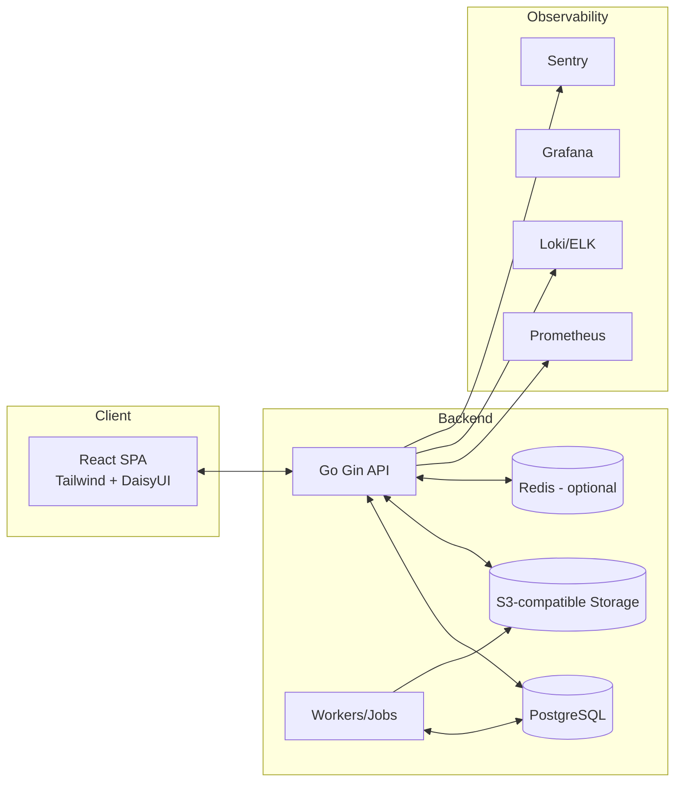
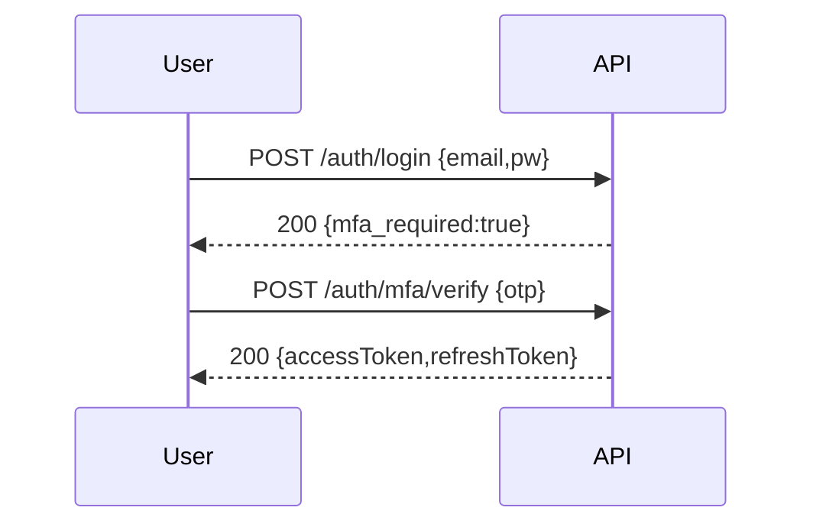
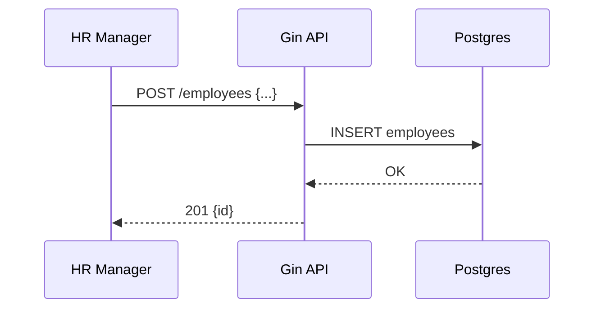
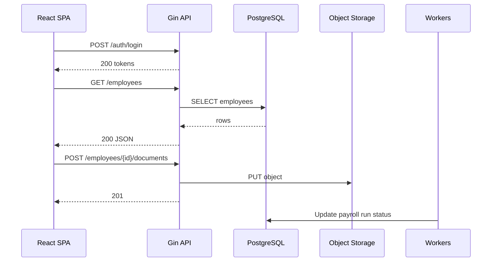

# Human Resource Management System (HRMS) – Software Requirements Specification (SRS)

Updated: 2025-10-21

This document is a complete, production-ready SRS with appendices and engineering artifacts suitable for direct implementation by a small engineering team. It targets the following stack:
- Frontend: React.js + Tailwind CSS + DaisyUI
- Backend: Golang (Gin framework)
- Database: PostgreSQL
- Containerization: Docker + Docker Compose (optional K8s)
- CI/CD: GitHub Actions
- Observability: Prometheus, Grafana, Loki/ELK, Sentry
- Security: gosec, Trivy, Dependabot, OWASP best practices

Defaults: Medium-sized company (200–1000 employees), single-tenant by default with a multi-tenant option, payroll rules generic (country-specific rules via configuration plugins), timezone UTC+3, currency configurable per-organization.

---

## 1. Introduction

### 1.1 Purpose
This SRS defines scope, behavior, interfaces, data model, nonfunctional constraints, and security/compliance requirements of a modern HRMS. It guides development, QA, DevOps, and product management.

### 1.2 Audiences and stakeholders
- Product managers (scope, priorities, acceptance criteria)
- Developers (architecture, API contracts, data schemas)
- QA engineers (test strategy, acceptance tests)
- DevOps/SRE (deployments, observability, backup/DR)
- Security/compliance (controls, audits, retention, privacy)
- Business stakeholders (HR, Finance/Payroll, IT Admins)

### 1.3 System overview and goals
- A secure, auditable HRMS covering employee data, recruitment, attendance, leave, payroll, performance, learning, reporting.
- Modular with RBAC, integrations (SSO, email/SMS, calendar, background checks, object storage), strong observability and CI/CD.

### 1.4 Definitions and acronyms
- HRMS, ESS (Employee Self Service), MSS (Manager Self Service), SSO (OIDC/SAML), MFA, RBAC, PII, RTO/RPO.

### 1.5 Assumptions and dependencies
- External providers: email/SMS (SendGrid/Twilio), SSO (OIDC/SAML), LDAP/AD sync (optional), S3-compatible object storage.
- Optional Redis for token blacklist, rate limit, caching.
- PDF generation: wkhtmltopdf or Go libs (gofpdf, go-pdf)
- Background job runner (Go workers/queues)

---

## 2. Overall Description

### 2.1 Context diagram


### 2.2 Deployment environments
- Dev: Docker Compose; seeded data; hot reload optional
- Staging: Compose/K8s; SSO test; feature flags; separate DB/storage
- Production: K8s or hardened Compose; managed Postgres; managed object storage; full observability; secrets manager

### 2.3 User classes
- Super Admin (platform), Org Admin, HR Manager, HR Staff, Manager, Employee, Recruiter, Accountant

### 2.4 Operating constraints
- Browsers: latest Chrome/Firefox/Safari/Edge; mobile (iOS/Android last 2 versions)
- Bandwidth: typical corporate networks; heavy tasks offloaded to workers

### 2.5 Design constraints
- GDPR/Privacy; data residency options
- Secrets via env/secrets manager
- Auditable changes and retention policies
- OWASP ASVS/Top 10 mitigations

---

## 3. Functional Requirements (FR)

Format per feature: description, actors, preconditions, normal/alternate flows, postconditions, API, data model, validation, acceptance criteria, tests.

### FR1: Authentication & Identity
- Description: Local login (bcrypt/argon2id), JWT access + refresh tokens with rotation, MFA (TOTP, optional SMS), SSO (OIDC/SAML), optional LDAP/AD sync.
- Actors: All users
- Preconditions: Active user; SSO configured if used; MFA enrolled if required
- Normal flow:
  1. POST /auth/login verifies credentials
  2. On success, issue accessToken (15m) & refreshToken (7–30d)
  3. If MFA enabled, require OTP verification
  4. Store rotating refresh token; invalidate prior token
- Alternate: invalid credentials (401), MFA failure (401), locked user (423)
- Postconditions: Valid tokens issued; refresh rotation tracked; blacklist on logout
- API: `/auth/login`, `/auth/refresh`, `/auth/logout`, `/auth/mfa/verify`, `/auth/me`
- Data: `users`, `refresh_tokens`, `user_mfa`, `audit_logs`
- Validation: RFC email; strong password policies; refresh rotation single-use
- Acceptance criteria:
  - Valid creds -> 200 with tokens; refresh rotates; logout blacklists; MFA enforced per policy
- Tests (3):
  - Happy: login -> 200 tokens; `/auth/me` returns profile
  - Boundary: min-length password succeeds; malformed email 400
  - Error: reused refresh token 401; account locked 423

Sequence (login with MFA):


### FR2: Authorization & RBAC
- Description: System roles + per-org custom roles; permissions matrix; policy checks
- Actors: Org Admin, Super Admin
- Preconditions: Authenticated; sufficient rights
- Normal: Create role -> assign permissions -> assign roles to users; policy middleware enforces
- Alternate: Permission cache invalidation on change; denials return 403
- API: `/roles`, `/roles/{id}`, `/roles/{id}/assign`, `/permissions`
- Data: `roles`, `permissions`, `role_permissions`, `user_roles`
- Validation: Unique role name per org; permission keys from whitelist
- Acceptance: Unauthorized blocked; changes audited; cache refresh on updates
- Tests:
  - Happy: create role + assign -> user gains access
  - Boundary: role name max length; many permissions
  - Error: assign non-existent permission -> 400

RBAC policy check (Go):
```go
func RequirePerm(key string) gin.HandlerFunc {
  return func(c *gin.Context) {
    perms := c.GetStringSlice("perms")
    for _, p := range perms { if p == key { c.Next(); return } }
    c.AbortWithStatusJSON(403, gin.H{"code":"RBAC_001","message":"forbidden"})
  }
}
```

### FR3: Employee Records Management
- Description: Full employee profile CRUD, documents, employment history, termination, audit trail
- Actors: HR Manager/Staff; Manager (limited); Employee (self)
- Preconditions: RBAC; org exists
- Normal: Create/update employees; upload docs to S3; audit changes
- Alternate: Soft-delete or terminate with reason; rehire
- API: `/employees` CRUD, `/employees/{id}/documents`
- Data: `employees`, `departments`, `positions`, `documents`, `audit_logs`
- Validation: Email unique per org; required fields; document MIME/type/size limits
- Acceptance: CRUD works; audits recorded; secure doc storage
- Tests: happy CRUD, duplicate email 409, invalid doc type 415

Sequence (create employee):


### FR4: Recruitment & ATS
- Description: Job requisitions, candidate pipeline, resume metadata, interviews, offers, onboarding tasks
- Actors: Recruiter, HR Manager, Manager
- Preconditions: Hiring needs recorded; roles/permissions
- Normal: Create job -> add candidates -> schedule interviews -> score -> offer -> onboarding tasks
- API: `/job-requisitions`, `/candidates`, `/interviews`, `/offers`
- Data: `job_requisitions`, `candidates`, `interviews`, `audit_logs`
- Validation: Stage transitions allowed set; schedule conflict checks; email template variables
- Acceptance: Pipeline transitions tracked; ICS/calendar integration optional; audit maintained
- Tests: create requisition; candidate stage change; double-book interview rejected

### FR5: Onboarding / Offboarding Workflows
- Description: Task templates, automatic assignment, e-signatures (optional), equipment tracking
- Actors: HR Manager, IT, Manager, Employee
- API: `/onboarding/templates`, `/onboarding/instances`, `/assets`
- Acceptance: tasks assigned, due dates calculated, completion tracked; offboarding revokes access
- Tests: template -> instance; overdue detection; revoke accounts on offboarding

### FR6: Time & Attendance
- Description: Clock-in/out, manual entries, timesheets, shift/rostering, overtime/break rules, webhook device integrations
- Actors: Employees, Managers, HR
- API: `/attendance/clock-in`, `/attendance/clock-out`, `/timesheets`, `/rosters`
- Validation: prevent overlaps; geo/IP constraints (optional)
- Acceptance: correct totals; approval workflow for manual entries
- Tests: happy clock-in/out; overlapping block; off-hours rule handling

### FR7: Leave & Absence
- Description: Leave types, accrual, carry-forward, holiday calendars, approvals, delegation
- Actors: Employee, Manager, HR
- API: `/leaves`, `/leave-balances`, `/leave-types`, `/holidays`
- Validation: balance must not go negative; non-overlapping; approver chain
- Acceptance: multi-level approvals, correct balances, holiday-aware
- Tests: request within balance, boundary exactly remaining, invalid date order 400

Accrual example (Go):
```go
func Accrue(balance, monthly, cap float64) float64 {
  nb := balance + monthly
  if nb > cap { nb = cap }
  return math.Round(nb*100) / 100
}
```

### FR8: Payroll & Compensation
- Description: Salary structure (basic, allowances, deductions, taxes), pay runs, payslips (PDF), bank exports, adjustments/audit
- Actors: Accountant, HR Manager
- API: `/payrolls/run`, `/payrolls/{id}`, `/payrolls/{id}/payslip`, `/bank-export`
- Validation: idempotent per employee+period; rounding rules; currency ISO 4217
- Acceptance: component sums consistent; audit on adjustments; reversals supported
- Tests: happy run; zero components; invalid currency 400

Plugin-based tax rules (Go):
```go
type TaxRule interface{ ComputeTaxes(g float64, ctx map[string]any) (float64, map[string]float64) }
```

### FR9: Performance & Goals
- Description: Goal setting, appraisal cycles, 360 feedback, weights/calibration
- API: `/goals`, `/appraisals`, `/feedback`
- Acceptance: scoring computed per weight; calibration changes audited
- Tests: create goals; compute score boundary; invalid weight sum 400

### FR10: Learning & Training (LMS-lite)
- Description: Courses, enrollment, completion certificates
- API: `/courses`, `/enrollments`, `/certificates`
- Acceptance: enrollment eligibility; certificate issuance on completion
- Tests: enroll course; duplicate enrollment blocked; invalid course 404

### FR11: Employee & Manager Self Service (ESS/MSS)
- Description: Profile management, payslip download, leave requests, approvals, team dashboards
- Acceptance: least privilege enforced; employee sees only own data; manager sees team
- Tests: profile update success; unauthorized access 403; payslip download

### FR12: Benefits & Compensation Planning
- Description: Benefit enrollment windows, eligibility rules, plan options
- API: `/benefits`, `/benefit-enrollments`
- Tests: enrollment window boundary; eligibility fail; plan switch

### FR13: Reports & Analytics
- Description: Predefined reports (headcount, turnover, payroll summary, leave trends), custom builder, CSV/PDF exports
- API: `/reports`, `/reports/export`
- Tests: generate report; filter boundary; large export pagination

### FR14: Notifications & Communication
- Description: Email/SMS templates, in-app notifications, push (placeholder), audit
- API: `/notifications`, `/templates`
- Tests: template render; send queue; audit creation

### FR15: Admin & Settings
- Description: Organization settings, departments, locations, cost centers, holidays, feature toggles, tenant settings (if multi-tenant)
- API: `/settings`, `/departments`, `/locations`, `/cost-centers`
- Tests: update settings; uniqueness constraints; feature toggle gating

### FR16: Assets & Inventory
- Description: Track employee assets (laptops, badges) with issuance/return
- API: `/assets`, `/asset-assignments`

### FR17: Document Management & Digital Signatures (optional)
- Description: Versioned docs, signatures via provider
- API: `/documents`, `/signatures`

### FR18: Compliance & Legal
- Description: DSR handling, retention policies, legal holds
- API: `/compliance/dsr`, `/retention-policies`

---

## 4. External Interface Requirements

### 4.1 UI
- SPA with Tailwind + DaisyUI. Accessible (WCAG 2.1 AA), responsive, keyboard navigable. Major screens: Login, Dashboard, Employee Profile, Timesheets, Leave, Payroll, Recruitment, Admin.

### 4.2 API
- REST JSON, versioned `/api/v1`, Bearer JWT, pagination (`page,limit`), sorting/filtering, rate-limit 100 req/min/IP (configurable). Error format:
```json
{"code":"EMP_001","message":"Employee not found","details":{"id":"uuid"}}
```

### 4.3 Integrations
- Email/SMTP, SMS, Calendar (Google/Microsoft), background checks, SSO (OIDC/SAML), bank export formats.

---

## 5. Nonfunctional Requirements
- Performance: p95 < 300ms simple GET; dashboard TTI < 2s under 200 conc.; baseline 500 conc. users
- Scalability: stateless API; horizontal scale; Postgres read replicas/partitioning roadmap
- Availability: SLA 99.9%
- Reliability: daily backups; RTO < 4h; RPO < 1h
- Security: TLS 1.2+; CSP; sanitization; rate limit; secrets mgmt; secure cookies (if used)
- Privacy: retention policies; DSR export/delete flows
- Observability: Prometheus metrics; structured logs; tracing (OpenTelemetry optional)
- Maintainability: linting; tests ≥ 70% coverage; modular code
- Accessibility: WCAG 2.1 AA

---

## 6. System Architecture

### 6.1 High-level sequence


### 6.2 Tokens and sessions
- Access token (15m), refresh (7–30d), rotation + blacklist on logout; device/session list optional.

### 6.3 Caching
- Optional Redis: token blacklist, permissions cache, rate limiter.

### 6.4 Async jobs
- Go worker pool or message queue for payroll, PDF, emails, large reports.

---

## 7. Data Model (Summary)
- Core tables: organizations, users, roles, permissions, role_permissions, user_roles, departments, positions, employees, attendance, leaves, payrolls, salary_components, documents, audit_logs, job_requisitions, candidates, interviews, notifications, settings, assets, asset_assignments, benefits, benefit_enrollments, reports.
- See `DB.md` for ERD and SQL migrations.

---

## 8. Security & Compliance
- JWT with refresh rotation and blacklist; password hashing (argon2id/bcrypt), MFA (TOTP/SMS)
- Transport security: TLS 1.2+, HSTS
- Headers: CSP, X-Content-Type-Options, X-Frame-Options, Referrer-Policy
- Input validation & sanitization; strict JSON schemas
- CORS: allowlist origins; preflight caching
- Rate limiting: per-IP and per-token
- Encryption at rest: encrypted disks; pgcrypto for PII columns; S3 SSE
- Secrets: env vars or secrets manager; no secrets in VCS
- Audit: append-only, tamper-evident, 7-year default retention (configurable)
- GDPR/PIPEDA: DSR export/delete, consent capture, lawful bases, data maps
- Tooling: gosec, Trivy, Dependabot; optional ZAP in staging; SAST/DAST gates
- Security acceptance criteria: CI fails on CRITICAL/HIGH vulns; no HIGH gosec findings (allowlist documented); pen test with no critical open items pre go-live

---

## 9. Observability, Logging & Alerts
- Structured JSON logs with correlation ID (X-Request-ID)
- Metrics: per-endpoint reqs/sec, latency, error rate; DB pool stats; worker queue depth; payroll run durations
- Prometheus: `/metrics` endpoint via promhttp; customized histograms
- Grafana: dashboards for API latency (p50/p95/p99), errors, worker backlog
- Alerts: error_rate > 5% (5m); p95 > 500ms (5m); DB pool > 80% (5m); worker backlog > 100 (10m)

---

## 10. Backup & DR
- Postgres: nightly logical backups + weekly physical; 30–90 day retention
- Object storage: lifecycle rules, versioning optional
- DR drills: quarterly restore verification
- Targets: RTO < 4h, RPO < 1h

---

## 11. CI/CD & Delivery
- GitHub Actions pipeline stages: lint (golangci-lint), vet, unit tests, frontend build, integration tests (services), Docker image build/push, Trivy scans, deploy to staging/prod
- Deployment: rolling/blue-green; health probes; zero-downtime migrations preferred

---

## 12. Testing Strategy
- Unit: Go + React Testing Library
- Integration: API + DB/Redis/MinIO in containers
- Contract tests: OpenAPI schema conformance
- E2E: Cypress/Playwright critical flows (login, employee CRUD, leave, payroll preview)
- Load testing: k6 scripts for hot endpoints
- Coverage: ≥ 70%

---

## 13. Operational Runbook (SRE)
- Key rotation: JWT secret, DB creds, S3 keys; schedule & procedure
- Incident management: severities, on-call, escalation, comms templates
- Postmortem template: impact, timeline, root cause, actions, owners, deadlines
- Rollback: previous image tag + down migrations as needed

---

## 14. Roadmap & Prioritization
- MVP (~200–260 SP): Auth/RBAC (25), Employee CRUD/Docs (30), ESS (25), Leave & Attendance (30), Payroll basics (40), Dashboard/Reports (20), Admin (20), Compose + basic observability (10)
- v1 (~260–320 SP): Recruitment (60), Onboarding (40), Advanced payroll & bank exports (60), Multi-currency (20), SSO (30), Integrations (50)
- v2 (300+ SP): Performance mgmt (80), Training (60), Device integrations (60), Advanced analytics/AI (100)

---

## 15. Multi-tenant SaaS Option
- Separate DB per tenant: strong isolation, higher ops overhead
- Shared DB + tenant_id: simpler ops, must enforce strict RLS and per-tenant keys
- Billing & onboarding: tenant creation, plan limits, org settings, per-tenant encryption keys optional
- Migrations: versioned per-tenant; feature flags for staged rollout

---

## 16. Appendix

### 16.1 Glossary
Key terms defined in §1.4; extend with org-specific vocabulary.

### 16.2 Seed data (excerpt)
See `DB.md` for full seed SQL (5 employees, 3 departments, 2 payroll entries).

### 16.3 Example Docker Compose
See `docker-compose.yml` in repository root.

### 16.4 Example CI Workflow
See `.github/workflows/ci.yml`.

### 16.5 Migration & rollback
- Timestamped up/down migrations; DB backup before destructive changes; feature flags for risky rollouts.

### 16.6 Legal/privacy boilerplate
- Purpose: HR administration; lawful bases (contract/legal obligation). Rights: access, rectification, erasure, restriction, portability, objection. Retention: employment duration + statutory period. International transfers safeguarded (SCCs). DPO contact.

---

## Completeness Checklist
- [x] SRS sections detailed
- [x] ≥25 API endpoints (see `API.md`)
- [x] ERD + SQL migrations (see `DB.md`)
- [x] Security checklist & automated scan gates
- [x] Docker Compose (root)
- [x] CI pipeline (GitHub Actions)
- [x] Observability & backup plans
- [x] Acceptance tests (spec-level) and test cases per major feature
- [x] Prioritized roadmap & MVP
